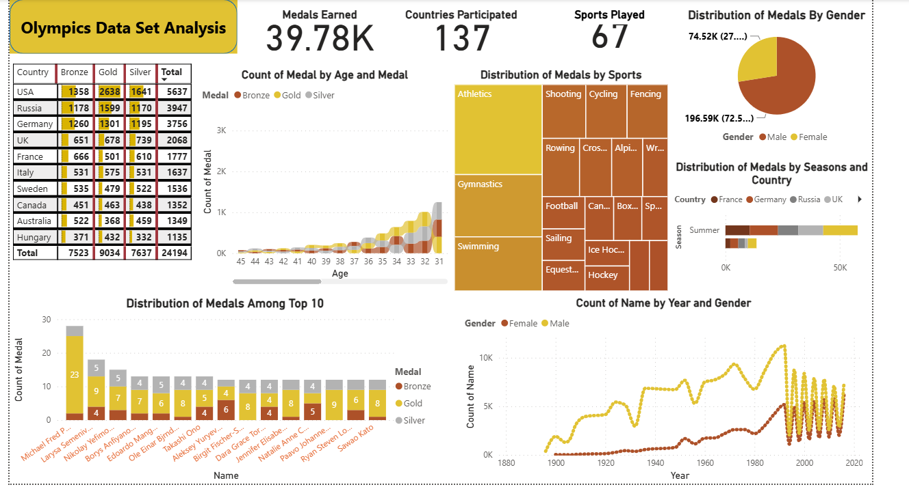

# -Olympics-Data-Analysis-Dashboard-Power-BI
## 📌This Power BI dashboard analyzes historical Olympic Games data to uncover trends in medal distribution, country performance, gender participation, and sports dominance across years.

## 🎯 Business Questions Answered
- Which countries have won the most medals?
- Which sports contribute the highest medal count?
- How has gender participation changed over time?
- Which age groups win the most medals?
- Seasonal medal distribution by country

## 📊 Key Insights
- USA leads total medal count across all Olympics
- Athletics, Gymnastics, and Swimming dominate medal distribution
- Male participation historically higher, but female participation shows strong growth
- Peak medal-winning age group is between 25–35 years
- Summer Olympics contribute majority of medals

## 🛠 Tools & Skills Used
- Power BI
- Power Query (ETL)
- Data Modeling
- DAX Measures
- Interactive Visuals & Slicers
- Data Cleaning & Transformation

## 📁 Files in This Repository
- `Olympics_Dashboard.pbix` → Interactive Power BI dashboard
- `dataset/` → Raw dataset
- `images/` → Dashboard screenshots

## 🚀 How to Use
1. Download the `.pbix` file
2. Open in Power BI Desktop
3. Refresh data
4. Explore insights using filters and slicers

## 👤 Author
Rhydam Kumar  
Aspiring Data Analyst
